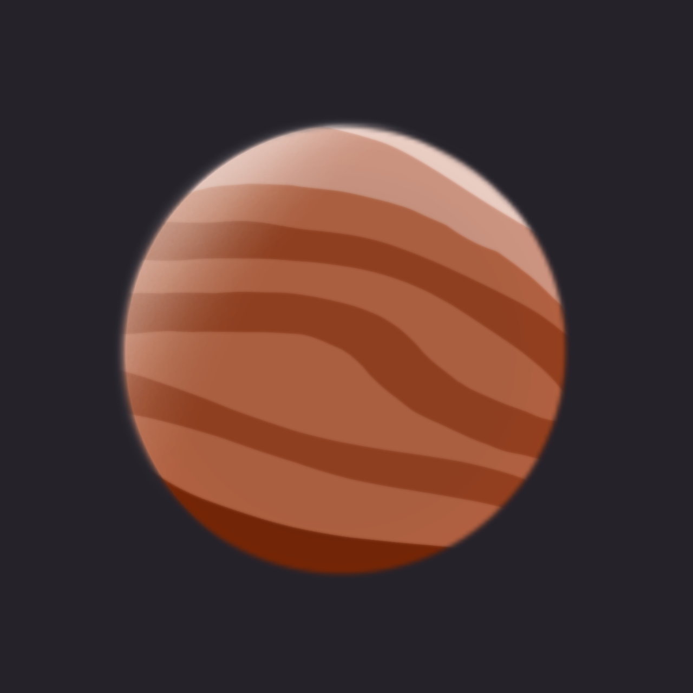

# MercuryMC
MercuryMC - сборка для Minecraft: Java Edition, нацеленная на оптимизацию игры. Имеет поддержку vulkan API, практически полностью заменяет все функции OptiFine, а также не имеет лишних модов. Вы получите многократный прирост FPS и при этом ничего не потеряете от привычного геймплея. 

Сборка имеет три версии:
- MercuryMC - стандартная сборка, нацеленная только на оптимизацию. 
- MercuryMC+ - сборка с практически полной заменой всех функций optifine. Если Ваше устройство отлично тянет основную версию сборки, то можете попробовать эту.
- MercuryMC vulkan - сборка с поддержкой vulkan API. Сборка не стабильна, поддерживается не на всех графических ядрах.

## Эффективность сборки
 Тест сборки на разном железе в стрессовых условиях:
 - AMD Phenom 8450 Triple / NVIDIA GeForce GT 630 (vanilla 9 fps, mercurymc 60 fps)
 - AMD A10-7850K / AMD Radeon(TM) R7 Graphics (vanilla 10 fps, mercurymc 45 fps)

## Контакты
- Главный разработчик: [agogus228](https:/t.me/agogus228)
- Помощник: [vertukv](https:/t.me/vertukv)
- Тестировщик: [shockwavetank](https:/t.me/shockwave0tank)

## MercuryMC в соц-сетях
- [GitHub](https://github.com/MercuryMC-Development-Team/MercuryMC-rus) - здесь основная документация и обновления сборки
- [Telegram](https://t.me/MercuryMC_updates) - группа с обновлениями сборки
- [Наш сайт](https://www.mercurymc.ml/) - сайт, созданный по преколу xd

## Моды MercuryMC
Информация и список модов, которые включает в себя сборка, Вы можете посмотреть [здесь](https://github.com/MercuryMC-Development-Team/MercuryMC-rus/blob/main/mods.md).

## FAQ
 - Как установить сборку? - инструкция по установке отлично задокументирована в файлах репозитория.                                                         
[Инструкция по установке MercuryMC/MercuryMC+](https://github.com/MercuryMC-Development-Team/MercuryMC-rus/blob/main/MercuryMC-installation.md)
[Инструкция по установке MercuryMC vulkan](https://github.com/MercuryMC-Development-Team/MercuryMC-rus/blob/main/MercuryMCvulkan-installation.md)
 - Где сборки на старые версии? - с декабря сборки на старые версии больше не поддерживаются. Архивные сборки Вы можете скачать [здесь](https://github.com/MercuryMC-Development-Team/MercuryMC-rus/releases/tag/v5.1.0).
 - Во время установки/игрового процесса у меня возникла ошибка, которая скорее всего связана со сборкой. Как её пофиксить? - Вы в любое время можете рассказать нам о своей проблеме во вкладке [issues](https://github.com/MercuryMC-Development-Team/MercuryMC-rus/issues). Мы постараемся решить Вашу проблему или пофиксить баг в новых версиях сборки.
